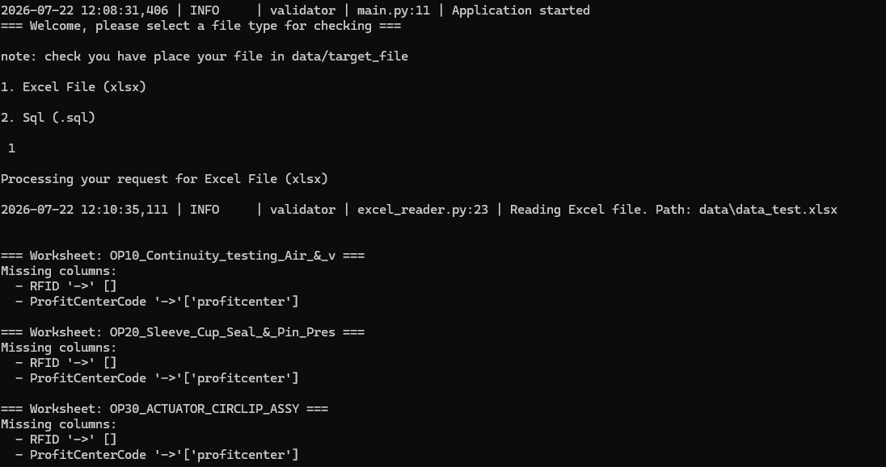
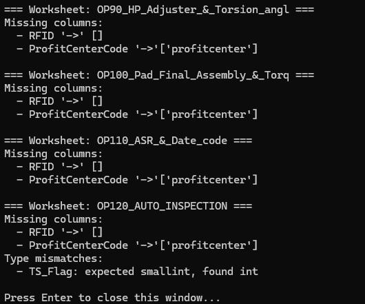

# Project Structure

```text
sql-validator/
│
├── main.py                  # Application entry point
├── requirements.txt         # Project dependencies
├── README.md                # Project documentation
│
├── data/
│   └── data_test.xlsx       # Sample xlsx file
│
├── logs/
│   ├── current_date──
│                     └── applog.txt
├── models/
│   ├── __init__.py
│   └── table.py             # Table data model
|
├── reader/
│   ├── __init__.py
│   └── excel_reader.py      # Validates table schema and data
│
└── common/
    └── logger.py            # Logging utilities
    └── load_config.py       # load config.yml
    └── app_log.py           # load app keys
```

# Supported File structure

#### Supported File type and stucture.

For the validator to work and check a given file. Certain structure is required, which is mentioned below:

1. ## Excel File (.xlsx):
   Multiple excel sheet can be processed , but each sheet should have the following structure.
   | Column Name | Data Type |
   | ----------- | ----------- |
   | RFID | VARCHAR(50) |
   | LineCode | VARCHAR(50) |
   | DTS_SCAN | Datetime |

# Executable File Structure:

Below you can find the structure for executable produced:

```text
validator/
│
├── Validator.exe      # Application entry point
├── config.yml         # Project dependencies
├── README.md          # Project documentation
│
├── data/
│   └── data_test.xlsx  # place the file to validate in this folder.
│
└─── logs/
    ├── current_date──
                     └── # app log will be available here.
```

# Screenshots

Demo screenshot of the application:



#### note: As you can see, it also reports:

1. the expected column and actual column found [likely-ness]
2. Expected column data type and reported data type.
